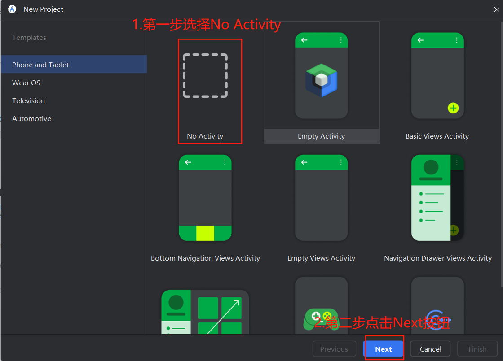
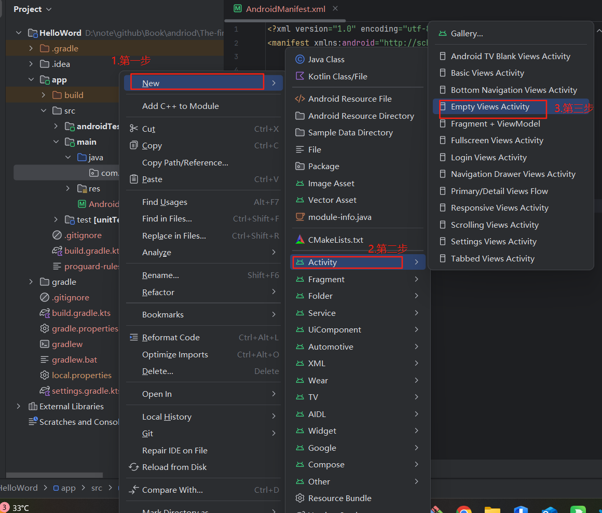
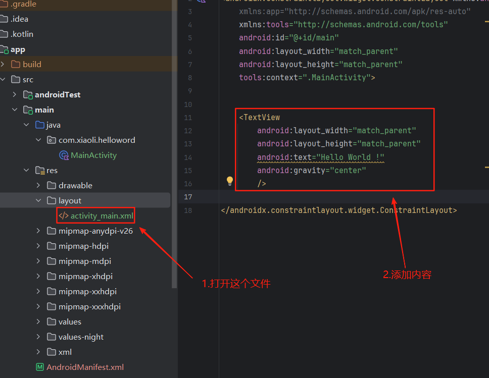

# 第 1 章 开始启程，你的第一行Android代码

## Android 系统的组成

Android操作系统按照自底向顶的分层分为如下四层
1. Linux内核层 : 作为 Android 系统的底层基础，直接与硬件交互，负责硬件资源的管理和调度
2. 系统运行库层 : 位于内核层之上，为上层（应用框架层）提供底层支持，包括 C/C++ 库和 Android 运行时环境。
3. 应用框架层 : 为应用开发者提供一系列标准化的 API（应用程序接口），开发者通过调用这些 API 快速开发应用，无需关注底层实现。
4. 应用层 : 直接面向用户，是用户可见的各类应用程序，由开发者基于应用框架层的 API 开发。


Android系统四大组件
- Activity
- Service
- BroadcastReceiver
- ContentProvider


## 创建一个Android项目
第一步：打开Anddroid Studio软件之后点击New Project按钮之后会让你选择项目类型如下图：

点击完成之后关于项目配置页面配置的含义如下：
1. Name表示项目名称
2. Package name 表示项目的包名
3. Sava location 表示项目代码存放的位置
4. Language 表示项目的开发语言，过去使用的Java进行开发，但是随着Kotlin的引入，新的项目大部分都是使用Kotlin语言进行开发
5. Minimum API 表示项目最低兼容的版本号


第二步 ：填写完信息输入 之后点击Finish按钮Android就会创建一个Android项目，创建成功页面如下：

第三步 ：Android Studio 2025最新下载的版本默认为Android模式，而Android模式不是很能直接反映出实际的目录结构，所以要设置为Project模式，如下操作实现设置为Project模式：

第四步 ：设置之后就会呈现输入的目录结构如下图：

第五步 ： 创建一个Activity，首先在在包右键 之后如下图选择创建一个Empty Activity


第六步 ： 设置配置创建Activity的信息


第七步 :  在创建的Activity的布局文件添加信息如下

```xml
    <TextView
        android:layout_width="match_parent"
        android:layout_height="match_parent"
        android:text="Hello World !"
        android:gravity="center"
        />
```

第八步 ： 配置Android项目的AndroidManifest.xml

```xml
        <activity
            android:name=".MainActivity"
            android:exported="true" >
            <intent-filter>
                <action android:name="android.intent.action.MAIN"/>
                <category android:name="android.intent.category.LAUNCHER"/>
            </intent-filter>
        </activity>
```

    


到这里我们使用Android Studio创建一个名为Hello World的Android项目便创建完成了。关于运行需要创建一个手机虚拟机或者使用一个物理机。之后点击运行项目便可以了
## 创建手机模拟器
我们这里为了运行上面我们创建的Hello World的Andorid项目，需要创建及一个虚拟机作为运行载体，创建载体如下步骤：

第一步：打开Android Studio开发软件创建的虚拟机的选择页面


第二步：选择创建的虚拟设备型号，下图创建的是手机 名称为 Pixel


第三步：设置虚拟设备的信息，如下图：


第四步：创建成功的标识


第五步：运行虚拟设备，这里第一次可能等待的事件比较长一些，具体时间和电脑设备有关


第六步：选择虚拟设备来运行我们的创建的Hello World 的安卓项目，


第七步 ： 运行结果如下图：


## 项目目录分析

首先对于根目录下的内容解释如下：
1. .gradle : 存放 Gradle 构建缓存与临时文件，完全由Android Studio开发软件自动生成
2. .idea   : Android Studio 的 IDE 配置目录，自动生成
3. .kotlin : 存放 Kotlin 编译器缓存、增量编译元数据
4. app     : 开发的目录 存放 代码、资源、清单文件、测试等全部放这里。
5. gradle  : Gradle Wrapper 目录，决定项目使用哪个 Gradle 版本，自动下载/缓存
6. gitignore : Git 忽略规则；Kotlin 项目默认会把 .kotlin/、.gradle/、.idea/、build/ 等排除掉。
7. build.gradle.kts : 根项目构建脚本（Kotlin DSL）；用 Kotlin 语法 写 Gradle 配置，不是 Groovy
8. gradle.properties : 全局 Gradle 属性；Kotlin 项目常在这里配置 kotlin.code.style=official、jvmargs 等。
9. gradlew : Linux/Mac 的 Gradle Wrapper 可执行脚本
10. gradlew.bat : Windows 的Gradle Wrapper 可执行脚本
11. local.properties : 本地 Android SDK/NDK 路径；Kotlin 项目同样依赖，自动生成
12. settings.gradle.kts : Kotlin DSL 形式 声明模块；默认只有 include(":app")，后续多模块再追加。

从上述目录看我们后续做应用开发只需要重点关注app目录和build.gradle.kts文件，那么对于app目录的解释如下：

1. build ： 模块级构建输出目录（APK、AAR、编译缓存）。可删，不参与版本控制。
2. src   ： 源码根目录
    1. androidTest ： Android 插桩测试（Espresso/UI/集成测试）代码放这里
    2. main        ： 真正的“业务代码”目录
        - java     ： 业务代码存放的目录 ，这里沿用了java的名称，使用Kotlin开发其实里面存放的是.kt文件
        - res      ： 资源目录（布局 XML、drawable、values、raw…）。与语言无关
        - AndroidManifest.xml  ： 模块级清单文件，声明四大组件、权限、App 名称等。
    3. test        ： 单元测试（JVM 级别）代码，同样用 Kotlin 编写
3. .gitignore      ： 模块级 Git 忽略规则；默认忽略 build/、.gradle/、本地配置等
4. build.gradle.kts ： 模块级构建脚本（Kotlin DSL）；写依赖、插件、编译参数、签名配置等。
5. prohuard-rules.pro ： ProGuard/R8 混淆规则；Kotlin 项目也用它压缩、优化、混淆代码。对于正式发布的版本一般都会设置，对于内部debug则不会设置


res目录是存放我们各种资源的目录，如程序的名称，图像等等如下解释
- drawable 存放位图或矢量图；后缀（hdpi、xhdpi、xxhdpi）对应屏幕密度，系统根据设备自动挑选。
- layout 存放 界面布局 XML 文件
- mipmap 存放 启动图标
- values 存放 纯数据资源 XML， 不包含图片或布局 默认是浅色模式
使用规则如下 @+每个资源的名称,这里我们可以看AndroidManifest.xml的使用如下代码：
```xml
    <application
        android:allowBackup="true"
        android:dataExtractionRules="@xml/data_extraction_rules"
        android:fullBackupContent="@xml/backup_rules"
        android:icon="@mipmap/ic_launcher"
        android:label="@string/app_name"
        android:roundIcon="@mipmap/ic_launcher_round"
        android:supportsRtl="true"
        android:theme="@style/Theme.HelloWord">
            
        </application>
```
## 项目运行的逻辑

首先我们需要打开AndroidManifest.xml这个文件，我们通过如下代码进行注册Activity，没有在这里注册的Activity是不能使用的
```xml
        <activity
            android:name=".MainActivity"
            android:exported="true" >
            <intent-filter>
                <action android:name="android.intent.action.MAIN"/>
                <category android:name="android.intent.category.LAUNCHER"/>
            </intent-filter>
        </activity>
```
其中intent-filter里的两行代码非常重要.首先是下面的配置表示当前Activity为项目主Activity，也就是用户进入程序首先启动的Activity
```xml
<action android:name="android.intent.action.MAIN"/>
<category android:name="android.intent.category.LAUNCHER"/>
```
对于注册的Activity通过如下代码进行展示,首先是继承AppCompatActivity这个父类，之后重写onCreate方法 最后使用setContentView方法设置展示的页面为activity_main.xml
```kotlin
class MainActivity : AppCompatActivity() {
    override fun onCreate(savedInstanceState: Bundle?) {
        super.onCreate(savedInstanceState)
        setContentView(R.layout.activity_main)
    }
}
```
## 日志

Android中的日志工具类是Log类中提供了如下5个方法打印日志。
1. Log.v() ：verbose级别的，是Android日志里面级别最低的一种。
2. Log.d() ：debug级别的，打印调试信息
3. Log.i() ：info级别的， 用于打印一些比较重要的数据，可以用于帮助我们分析用户行为的数据。
4. Log.w() ： warn级别 ， 用于打印一些警告信息，提示。
5. Log.e() ： error级别 用于打印程序中的错误信息。
使用如下：
```kotlin
class MainActivity : AppCompatActivity() {
    override fun onCreate(savedInstanceState: Bundle?) {
        super.onCreate(savedInstanceState)
        setContentView(R.layout.activity_main)
        Log.d("日志的tag" , "日志信息")
    }
}
```
启动程序在LogCat可以查看到如下信息：
