# Kotlin语法
对于Kotlin语言的推出是替代Java在Android的地位，并且Kotlin源码在编译器通过Kotlin编译器生成Java的字节码，为此Java相关的数据结构 IO 反射 集合 Socket网络编程等等Kotlin也应该有对应的内容。


## 变量
Kotlin语言在变量的声明中设计了可变var和不可变val，声明一个变量就必须声明其的可变性这个特点，对于变量的类型，kotlin采用Java 10的特点类型推断，当然也可以声明类型。
```kotlin
    fun main(){
        // 不可变变量
        val a  = 10
        // 可变变量
        var b = 20
        println("a = " + a + "\t b = " + b)
    }
```

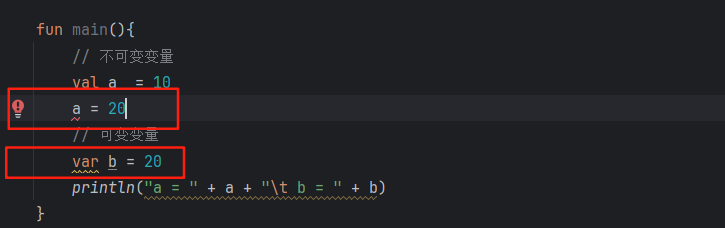
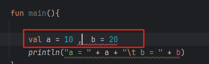
如上图展示： 
- 对于不可变变量a 我们更改它的值就会发现显示了错误提示
- 对于可变变量b 我们后续不去修改它的值就会发现显示了警告提示
- 对于类型的声明采用Java10的特性类型推断，对变量10会推断成Int类型


对于Kotlin的类中声明语法如下，
```kotlin
    fun main(){
        val a : Int  = 10
        val b : Long = 20
        println("a = " + a + "\t b = " + b)
    }
```
Kotlin中的变量类型没有基本类型，全是包装类，这里也体现Kotlin一个特性，以及面向对象走的比Java更彻底。
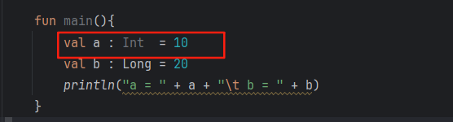

从上图我们也发现了如果对于变量a我们声明为Int类型这里显示灰色，也证明了整数在Kotlin默认的Int类型这一事实。

其中Java和Kotlin的类型对照表如下：
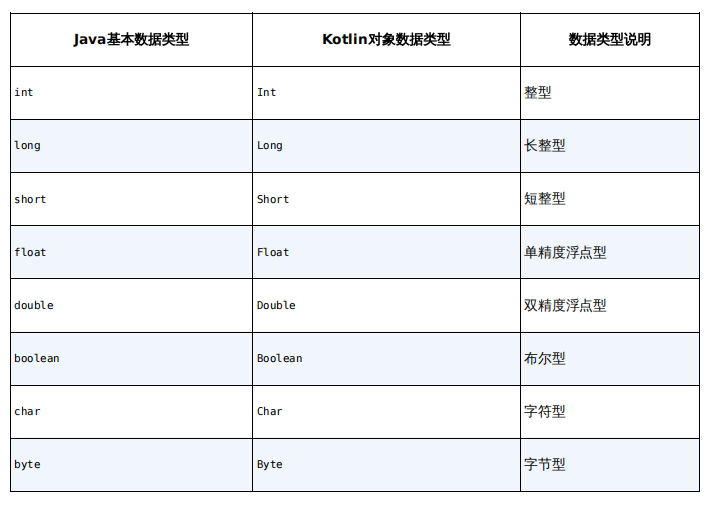

Kotlin语言还提供了变量是否可以为空的语法设定，不声明变量类型是可以为空的，但是对于声明了变量类型默认是可以为空的，这样可以很大程度上避免应空指针导致的的安全问题。
```kotlin
    val list1 = null
    val list2 : ArrayList<Int> = null
    val list3 : ArrayList<Int>? = null
```
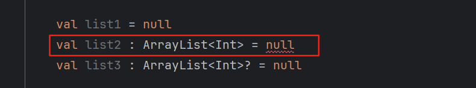

对于Kotlin提出的类型可变与非可变 + 是否为空 保证了一部分情况下在编译期保证安全性的一种方式，但是对于可变属性的安全性还是没有直接在编译期解决这个问题，但在17年诞生的rust的语言提出了变量的声明周期缺在safe下写的代码完美的实现了在编译期实现了程序的安全性问题。
## 函数

函数的声明的格式为 fun 函数名(参数) : 返回值的类型。如下代码为kotlin声明一个函数
```kotlin
// 参数 + 返回值
fun funName01(param1:Int , param2: ArrayList<String>) : Map<Int, String>? { return null }
// 无参 + 返回Unit(无返回值类型 对应void)可以不写
fun funName02(){}
// 可变参数 + 无返回值
fun funName03(param1:Int  , vararg param2:String){}
```
Kotlin函数对于最后一个参数为可变参数的设置使用的 vararg这个关键字，并且与Java语言一致只可以存在于最后一个参数的位置。

Kotlin对于函数方面的语法糖
```kotlin

// 函数体只有一行的 使用 =
fun funName01(param1: Int , param2:Int) : Int = param1 + param2
// 函数体只有一行的 + 类型推到 可以省去返回值的声明
fun funName02(param1: Int ,param2: Int) = param1 + param2

```


## 逻辑控制
对于程序的逻辑控制Kotlin支持 if when 两种条件语句如下代码：
```kotlin
    var a : Int = 10
    // if条件判断
    if(a > 10){
        a = 20
    }else if(a > 5){
        a = 40
    }else {
        a = 80
    }
    // kotlin的语法糖
    var b = if(a > 10) 20 else if (a > 5) 30 else 100
    
    // when语句
    // 这里when语句必须列举除所有的可能，以及列举的可能必须是存在的 
    // 比如这里使用下的 is Double就会出错
    when(b){
        20 -> println("a > 10")
        30 -> println("a > 5")
        100 -> println("a <= 5")
    }
    // Number数值类型 内置的抽象类 所有数字相关的类型都是其子类 
    // 这里也可以看到Kotlin相比Java面向对象做的更加完善
    var c : Number = 100
    when(c){
        is Int -> println("a > 10")
        is Double -> println("a > 5")
        else -> println("a <= 5")
    }
```
【注意】when 语句必须列举可能存在的，不然编译是过不了的，这也是Kotlin相对Java提高了代码安全的体现,虽然相对后面的Rust不是很完善。

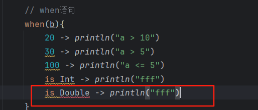

for foreach while do..while几种循环语句 如下代码：
```kotlin
    // [0 , 10]区间的值 这里相对python语言的在区间的开闭有一定区别
    var range = 0..10 
    // 使用forin 循环
    for (i in range) println(i)
    // [0,10)
    for (i in 0 until 10) println(i)
    // [0,2 , 4 , 6, 8) 设置步长
    for (i in 0 until 10 step 2) println(i)
    // 逆序 关键字 downTo [10 , 1]
    for (i in 10 downTo  1) println(i)
```

## 面向对象

### 类
Kotlin在面向对象方面和Java保持一致选择的是单继承 可以实现多个接口的形式，只是对于创建对象抛弃了传统面向对象语言 使用new关键字创建对象的方式。
```kotlin
class OOPMain1 {
    
    private var id : Int = 0;
    
    private var username : String = ""
    
    public fun show() : Unit = println("my id is " + this.id + "\t username is " + this.username)
}
fun main() : Unit{
    val obj = OOPMain1()
    obj.show()
}
```
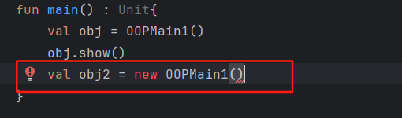

Kotlin默认类是不可以被继承的，如果想要基层就需要使用open关键字修饰类,并且对于构造方法也做了区分，分别是主构造方法 + 次构造方法的语法设定，并且对于主构造方法的参数使用val或者var变量修饰，被修饰的变量将不单单是一个构造方法的参数而还做了声明了被修饰付变量同门的成员变量，这里就类似python语言在面向对象的一些设定。

对于主构造方法的代码块的语法设定为init关键字修饰的代码块便是主构造器的构造函数的代码块。
```kotlin
open class OOPMain1Father{}

class OOPMain1(var id : Int , val username : String) : OOPMain1Father() {
    
    init {
        // 主构造方法的逻辑
        this.id *= 10
    }
    
    constructor(id: Int) : this(id ,"username" + id) {}
    constructor():this(10){}
    
    public fun show() : Unit = println("my id is " + this.id + "\t username is " + this.username)
}
fun main() : Unit{
    val obj = OOPMain1(1,"username1")
    println(obj.id)
    obj.show()
}
```

验证Kotlin是否为单继承 如下图

```kotlin
open class OOPMain1Father1{}
open class OOPMain1Father2{}

class OOPMain1(var id : Int , val username : String) : OOPMain1Father1(),OOPMain1Father2(){
}
```
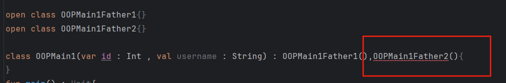
### 接口
Kotlin语言对于接口的关键字是否能实现，没有类是否可以继承关键字的设定，默认都是可以实现的，这个根据Java对于接口的性质也可以推断出来，因为Java中接口不可以被final关键字修饰。如下定了两个接口。
```kotlin
interface OOPMain1Interface2{
    fun show2()
}
interface OOPMain1Interface1{
    fun show1()
}

```
Kotlin语言通过接口来实现多态这个面向对象的体现，如下代码：
```kotlin
interface OOPMain1Interface2{
    fun show2()
}
interface OOPMain1Interface1{
    fun show1()
}

open class OOPMain1Father1{}

class OOPMain1(var id : Int , val username : String) : OOPMain1Father1()  ,  OOPMain1Interface1 , OOPMain1Interface2{
    override fun show1() {
        TODO("Not yet implemented")
    }

    override fun show2() {
        TODO("Not yet implemented")
    }

}
fun main() : Unit{
    val obj1 : OOPMain1Interface1 = OOPMain1(1,"username1")
    val obj2 : OOPMain1Interface2 = OOPMain1(2,"username2")
}
```
Kotlin具备类型推断这项机制，并且Kotlin源码通过Kotlin编译器会转换成Java的字节码文件，由此可以推断出Kotlin一定支持Java JDK10(因为JDK10才提出类型推断这项特性)之前的所有特性，其中就包含关于接口可以存在实现的方法，如下代码：
```kotlin
interface OOPMain1Interface1{
    fun show1()
    fun method(){
        println("====")
    }
}
```
### 权限修饰符

Kotlin的权限修饰符和java有一定的区别，如下表格:
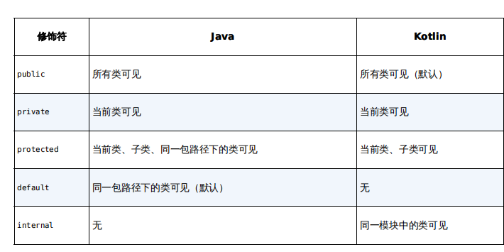

### 实体类
在开发中我们经常创建一些实体类，这些实体类一般由 几个成员方法 + get/set方法 + 重写的equals toString hashCode等这些方法来组成，对于这些可以预见的Java生态中有个Lombok通过@Data注解实现了这些动态的生成这些方法。Kotlin为了简化实体类的创建直接设定了data关键字修饰类和Java中使用Lombok提供的@Data注解几乎一个效果。data关键字的使用如下代码：

```kotlin
data class User(val id : Int , val username:String ,val password:String){}
fun main() : Unit{
    val user1 = User(1 , "username1" , "password1")
    val user2 = User(1 , "username1" , "password1")
    println(user1)
    println("user1.hashCode = " + user1.hashCode())
    println("user2.hashCode = " + user2.hashCode())
}
```
运行结果如下：
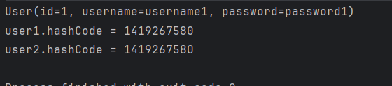
根据运行结果我们可以看到，由于user1和user2的所有成员变量都相同，为此对应的hashCode也相同，说明data修饰的类重写了hashCode方法。

### 单例类
单例这个设计模式，在业务开发中是常被用的一种设计模式。在Java中单例一般的做法使用private关键字修饰类构造方法，之后提供一种只会实例化一次类的方法。

Kotlin提供了关键字单例类，使用object关键字替换class关键字，代码如下：
```kotlin
object OOPMain2 {
}
fun main(){
    println( OOPMain2.toString())
//    val obj = OOPMain2()
}
```
如果不注解val obj = OOPMain2()这行代码就会出现错误提示，如下图：
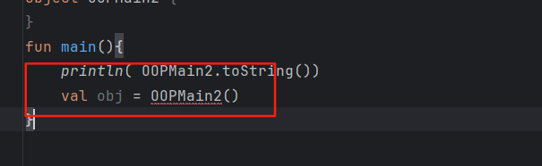


### Lamdba表达式
上面提到Kotlin在一些特性上应该具备Java 10之前所有的特性，Lamdba表达式也在其中，但是Kotlin对于Lamdba表达式的使用上做了很大的增强。


## 集合

### List集合


## 空指针检查


