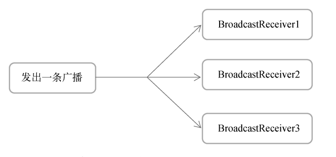
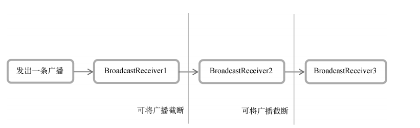

# 全局大喇叭，详解广播机制


## 标准广播
完全异步执行的广播，在广播发出之后，所有的BroadcastReceiver几乎会在同一时刻收到这条广播消息，因此它们之间没有任何先后顺序可言。这种广播的效率会比较高，但同时也意味着它是无法被截断的。



### 静态注册实现开机启动
动态注册的BroadcastReceiver可以自由地控制注册与注销，在灵活性方面有很大的优势。但是它存在着一个缺点，即必须在程序启动之后才能接收广播，因为注册的逻辑是写在onCreate()方法中的。


在Android 8.0系统之后，所有隐式广播都不允许使用静态注册的方式来接收了。隐式广播指的是那些没有具体指定发送给哪个应用程序的广播，大多数系统广播属于隐式广播，但是少数特殊的系统广播目前仍然允许使用静态注册的方式来接收。

这些特殊的系统广播列表详见:
https://developer.android.google.cn/guide/components/broadcastexceptions.html


### 发送自定义广播


在Android8.0系统之后，静态注册的BroadcastReceiver是无法接收隐式广播的，而默认情况下我们发出的自定义广播恰恰都是隐式广播。因此这里一定要调用setPackage()方法，指定这条广播是发送给哪个应用程序的，从而让它变成一条显式广播，否则静态注册的BroadcastReceiver将无法接收到这条广播


```xml
        <receiver
            android:name=".receiver.MyBroadcastReceiver"
            android:enabled="true"
            android:exported="true">
            <intent-filter>
                <action android:name="com.example.broadcasttest.MY_BROADCAST"/>
            </intent-filter>
```
```kotlin
        val button : Button = findViewById<Button>(R.id.button)
        button.setOnClickListener {
            val intent = Intent("com.example.broadcasttest.MY_BROADCAST")
            intent.setPackage(packageName)
            sendBroadcast(intent)
        }

```


## 有序广播
一种同步执行的广播，在广播发出之后，同一时刻只会有一个BroadcastReceiver能够收到这条广播消息，当这个BroadcastReceiver中的逻辑执行完毕后，广播才会继续传递。所以此时的BroadcastReceiver是有先后顺序的，优先级高的BroadcastReceiver就可以先收到广播消息，并且前面的BroadcastReceiver还可以截断正在传递的广播，这样后面的BroadcastReceiver就无法收到广播消息了。



查看完整的系统广播列表，可以到如下的路径中去查看
```xml
<Android SDK>/platforms/<任意android api版本>/data/broadcast_actions.txt
```


## 广播的最佳实践：实现强制下线功能


